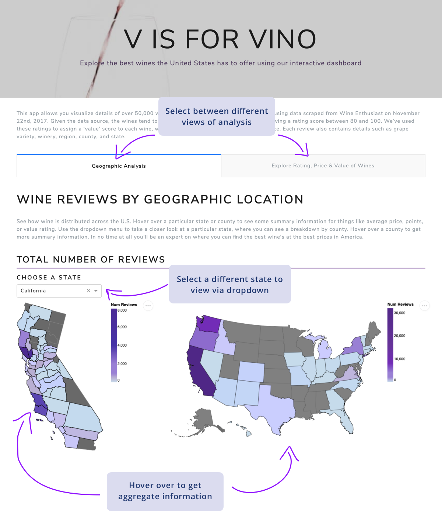
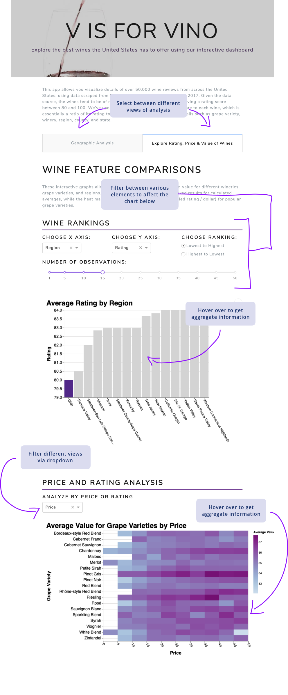

# DSCI532_Group204_Vino

## Dash App: Milestone 2

The app can be accessed [here.](https://group204-vino-milestone2.herokuapp.com)

### Summary of App Functionality

This app allows users to visualize details of over 50,000 wine reviews from across the United States, using data scraped from Wine Enthusiast on November 22nd, 2017. Given the data source, the wines tend to be of relatively high quality, with each receiving a rating score between 80 and 100. We’ve used these ratings to assign a ‘value’ score to each wine, which is essentially a ratio of its rating to price. Each review also contains details such as grape variety, winery, region, county, and state.

The ‘Geographic Analysis’ tab shows how wine is distributed across the U.S. A user can hover over a particular state or county to see things like average price, points (rating), or value. A dropdown menu allows users to take a closer look at a particular state, where they can see a breakdown by county. Hovering over a county provides similar summary information.

The ‘Explore Rating, Price & Value of Wines’ tab allows users to explore the price, points (rating) and value for different wineries, grape varieties, and regions. The bar chart shows dynamically ranked results for calculated averages. Dropdowns allow the user to select which data to display on each axis, a slider is provided to select how many bars to display, and there is a radio button selection to choose to rank the bars in either ascending or descending order. The heat map shows the distribution of value (scaled rating / price) for popular grape varieties across either price or rating ranges, depending on the dropdown selection.

## Original Proposal: Milestone 1

The main proposal file for this project milestone can be found [here.](https://github.com/UBC-MDS/DSCI532_Group204_Vino/blob/master/proposal.md)

### App Sketch & Description

The app is created to allow users to explore the wine industry within the United States. It includes functionality to analyse geographic features with choropleth maps of the U.S., and functionality to analyse details about price, ratings, or value for a particular winery, region, or grape variety. The app is designed with an easy to use UI separating the views into one of two tabs to easily frame their research and avoid overcluttering their browser window. A focus on user interaction and aesthetically pleasing design elements puctuated by a consistent color scheme underpin the usefulness and usability of this app. The app includes many useful hover and tooltip elements as well as interactive dropdowns, buttons and views which will allow the user complete control of what they see allowing for self discovery of different wine charachteristics. Future versions aim to include search features allowing users to gain insights on specific bottles of wine. The two views are summarized in the sketches below:

#### Geographic View

#### Wine Feature View

