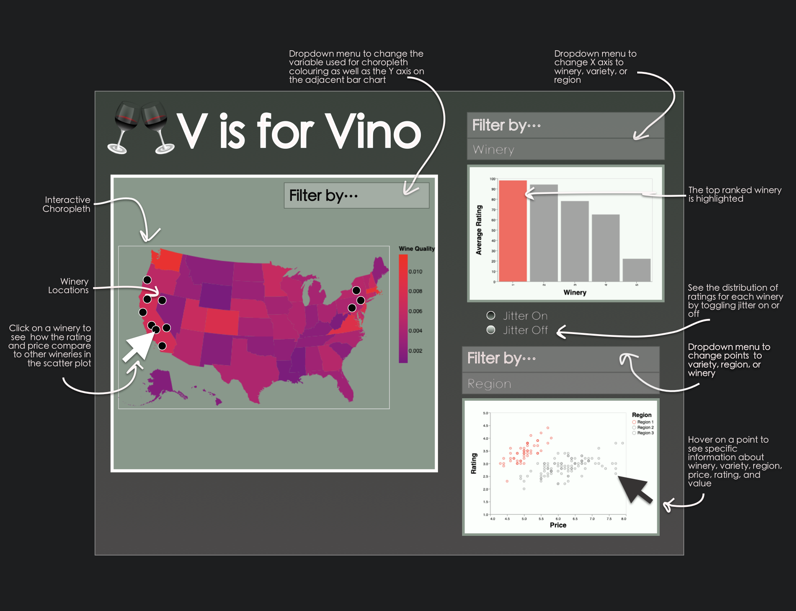

# DSCI532_Group204_Vino

The main proposal file for this project milestone can be found [here.](https://github.com/UBC-MDS/DSCI532_Group204_Vino/blob/master/proposal.md)

## App Sketch & Description

The app will consist of a choropleth map of the USA, as well as adjacent interactive plots showing details about price, ratings, or value for a particular winery, region, or grape variety.  From a dropdown beside the map, the user can choose whether to display price, rating, or value data for the choropleth map colouring. This selection also determines what data gets displayed along the y-axis in the adjacent bar chart. Similarly, clicking on a particular winery or region within the map will cause the adjacent scatter plot to filter dynamically to reflect the selection. Users are able to view distributions for a particular attribute by enabling jitter points from a radio button selection, and can make additional filter selections for each plot with their respective dropdowns.

